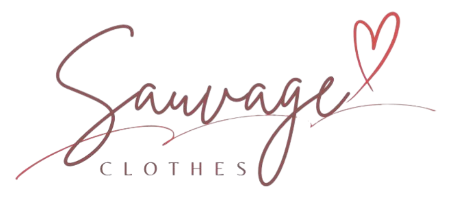

# Sauvage Clothes



**Sauvage Clothes** es una marca de ropa que fusiona el lujo y el streetwear para ofrecer prendas cómodas y elegantes, diseñadas para el bienestar y el autocuidado.

> "Sé Auténtico. Sé Libre. Sé Salvaje."

## 🚀 Despliegue

El proyecto está desplegado y disponible en:  
🔗 **[https://sauvage-clothes.netlify.app](https://sauvage-clothes.netlify.app)**

## 🛠️ Tecnologías Utilizadas

Este proyecto ha sido construido utilizando tecnologías web modernas:

- **HTML5**: Estructura semántica del sitio.
- **Tailwind CSS**: Framework de utilidad para un diseño rápido, responsivo y personalizado (cargado vía CDN).
- **JavaScript (Vanilla)**: Lógica del cliente para el carrito de compras, carga de productos y manejo del DOM.
- **Phosphor Icons**: Iconografía moderna y flexible.
- **Google Fonts**: Tipografías _Cinzel_ (títulos) e _Inter_ (texto) para una identidad visual premium.

## ✨ Características

- **Diseño Responsivo**: Adaptado a dispositivos móviles, tablets y escritorio.
- **Carrito de Compras**: Funcionalidad de agregar, eliminar y ver productos en un sidebar.
- **Checkout vía WhatsApp**: Integración para finalizar la compra enviando el pedido directamente a WhatsApp.
- **Catálogo Dinámico**: Renderizado de productos basado en datos (JavaScript).

## 📂 Estructura del Proyecto

```text
sauvageClothes/
├── css/            # Estilos personalizados
├── img/            # Imágenes y assets (Logos, productos)
├── js/             # Lógica de la aplicación
│   ├── data.js     # Base de datos simulada de productos
│   ├── script.js   # Lógica principal (UI, Carrito, Eventos)
│   └── product.js  # Lógica específica de productos
├── index.html      # Página principal
├── about.html      # Página "Sobre Nosotros" / Manifiesto
└── product.html    # Detalle de producto
```

## 📦 Instalación y Uso Local

1.  **Clonar el repositorio:**

    ```bash
    git clone https://github.com/usuario/sauvageClothes.git
    cd sauvageClothes
    ```

2.  **Abrir el proyecto:**
    Simplemente abre el archivo `index.html` en tu navegador web favorito o utiliza una extensión como "Live Server" en VS Code.

## 📄 Licencia

Este proyecto fue desarrollado para **Sauvage Clothes**.
Todos los derechos reservados © 2025.
